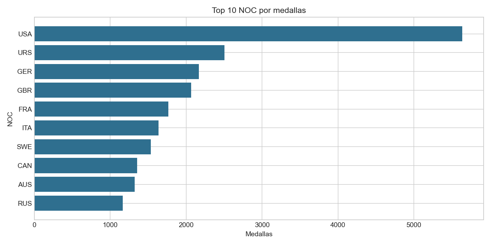
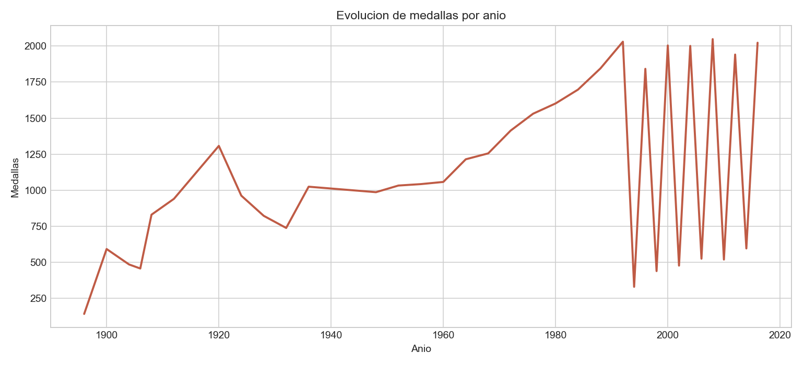
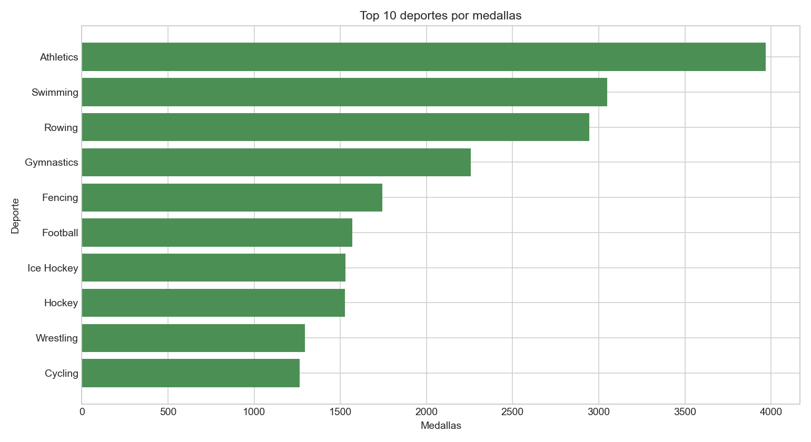
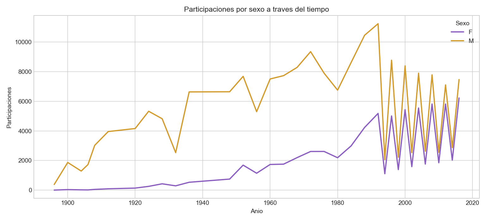

# Informe del Proyecto BI - Juegos Olimpicos

## 1. Objetivo
Desarrollar un proceso completo de analitica de datos sobre una base historica de Juegos Olimpicos, usando Microsoft BI y Python.

## 2. Fuentes de datos
| Archivo | Filas | Rol en el modelo |
|---|---:|---|
| Athletes_Games.csv | 187,433 | Dimension Atleta |
| Edition_Games.csv | 52 | Dimension Edicion |
| equipos_Games.csv | 1,231 | Dimension Equipo/NOC |
| Events_Olimpycs.csv | 269,798 | Fuente enriquecida |
| JJ.OO.csv | 269,798 | Hechos de participacion |

## 3. Calidad de datos
No se encontraron filas duplicadas ni valores nulos. Las llaves de la tabla de hechos tienen integridad con las dimensiones: 0 registros huerfanos en atleta, equipo, edicion y competencia.

## 4. Proceso ETL
Extraccion desde CSV, limpieza de textos, renombrado de columnas, creacion de `dim_competencia`, indicadores de medalla y carga a SQLite/CSV.

## 5. Modelo analitico
Modelo estrella con `fact_participacion` como tabla de hechos y las dimensiones `dim_atleta`, `dim_equipo`, `dim_edicion` y `dim_competencia`.

Medidas principales: participaciones 269,798, medallas 39,773, oro 13,369, plata 13,109, bronce 13,295, tasa de medalla 14.74%.

## 6. Dashboard Power BI
Importar los CSV de `csv_powerbi`, crear relaciones y usar KPI, barras por NOC, linea por anio, columnas por deporte/tipo y slicer de temporada, medalla o NOC.

## 7. Dashboard Python
Se genero `dashboard_plotly_olimpicos.html` con cuatro graficos interactivos.

## 8. Analisis comparativo
| Criterio | Microsoft BI | Python |
|---|---|---|
| Facilidad | Visual y orientado a negocio. Requiere SQL Server, SSDT y Power BI. | Requiere programar, pero queda reproducible. |
| Flexibilidad | Fuerte en modelos gobernados y reporting corporativo. | Muy flexible para limpieza, automatizacion y visualizacion. |
| Escalabilidad | Alta con SQL Server, SSIS y SSAS. | Alta al integrarse con bases, Spark o nube. |
| Aplicabilidad | Publicacion empresarial y seguridad. | Exploracion, ciencia de datos y prototipos analiticos. |

## 9. Conclusiones
El modelo estrella permite analizar desempeno olimpico por NOC, deporte, evento, anio, temporada y sexo. Microsoft BI es conveniente para publicacion empresarial; Python aporta trazabilidad y automatizacion del ETL.
